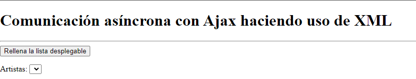
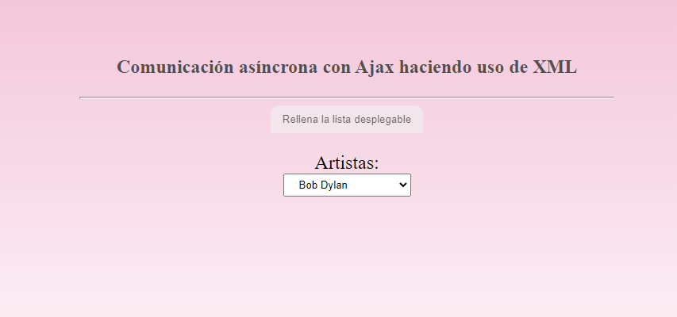

## Uso De Ajax
En este pequeño proyecto se utilizará la técnica Ajax para recargar partes de la
página sin que se tenga que recargar completamente.

el objetivo es pasar de esto:

a esto:

Nótese que la lista de artistas no aparecía en la primera imagen, es decir, al inicio de la página. Al pulsar el botón, se carga la lista y se añaden los estilos.

## [Prueba aquí](https://esmeldy.github.io/UsoDeAjax/)

